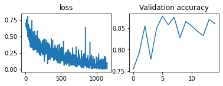

# CatsVDogs
Pytorch based CNN to identify cats and dogs

Find the dataset here -> https://drive.google.com/open?id=181j8UCrxIuW50YKpVuDo4EosYuiQn5zN

The dataset essentially contains ~24000 images of cats and dogs together. 
The images have been converted to monochrome 50x50 matrices and stored. The way its currently stored enables it to be compatible with pytorch's dataloader utility.

On a isolated validation batch of size 400, the following results were obtained.

\
Note: Max accuracy here was 87.75%. 

2 CNN architectures are available for comparison (6 and 7 conv layers respectively). We're limited to a best case accuracy of ~90% due to the extreme resizing undergone by the images. If higher resolution images are used, the accuracy drastically increases but so does the computational load.\
Refer to det_analysis.pdf for a detailed report of the project.
